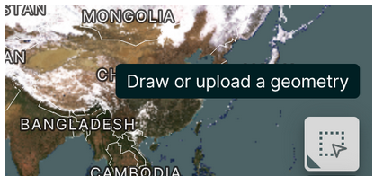
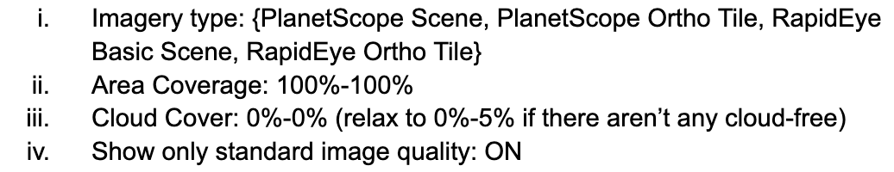
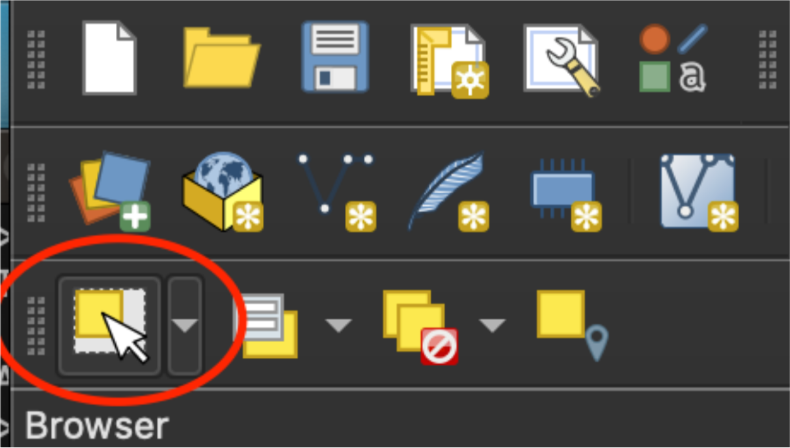

# Report Evidence Directory Manifest
This directory contains evidence files for my report submission. This directory contains basic input data and the scripts needed to use it, but also already contains the results of using said scripts. An environment file is provided specifying all dependancies.

The file are split into three directories as follows.

## input_data
Input data for the codebase as follows:

- **ob_raw:** CSV containing building polygons from the Openbuildings Dataset for Boane
- **outliers:** CSV specifying which tiles are to be marked as outliers
- **planet_context:**  300x300-meter tiles at 3-meter-per-pixel resolution for each survey grid
    - Tiles are provided in [GeoTiff format](https://www.loc.gov/preservation/digital/formats/fdd/fdd000279.shtml). One can [install GDAL](https://gdal.org/download.html#) and use the `gdalinfo` command to extract information from geotiff files.
- **planet_lowres:**  100x100-meter tiles at 3-meter-per-pixel resolution for each survey grid
    - See extra info under planet_context
- **survey_raw:** Raw survey data in .dta format for Boane, as well as shapefiles specifying grid layout
- **survey_tiles:** 100x100-meter tiles at 0.5-meter-per-pixel resolution for each survey grid
    - See extra info under planet_context

The readme.md under pep specifies how this data should be used.

## pep
My branch of the SCIPE codebase originally developed by Isaac Neal. The codebase has been extended to support the experiments I carry out.

Input data is not included in the public repository for access reasons, however I have provided it seperately with this evidence submission.

Several scripts are provided with the codebase. Only rasterize_suvey, rasterize_ob, and run_pipeline need to be run to replicate my results.

Experiment configuration is controlled by .yaml files. I have provided files to replicate each experiment I have run, and a generic file with comments is presented to explain options.

Output files for each experiment I have run are included.

## planet
Directory containing the scripts I used to create PlanetScope orders, download imagery, and preprocess imagery for use by the SCIPE codebase.

Scripts are used as follows:

1. Run [`scripts/clustertiles.py`](./planet/scripts/clustertiles.py) <`/input_directory/`> - takes refernce high-resolution imagery from the input directory and clusters based on geographic distance. Generates a directory for each cluster containing a geojson boundary polygon for each cluster.
2. Using Planet Lab's [planet explorer](https://www.planet.com/explorer), search for imagery covering the geojson polygon as so:
    1. Search specifically over the polygon by selecting the "draw or upload geometry" option and uploading the geojson file. 
    - 
    2. Use the following filters
    - 
    3. Filter date as needed - ideally, select images from as close to the date of your ground truth survey as possible (Spring 2019 in the case of the survey I use).
    4. Select imagery from the left menu, and note the "product type"
    5. Click the API{:} button, then copy the item ids
3. With order ids and image type, copy the ordertemplate.json file into the cluster directory and fill in as appropriate. Example filled-in orders are provided with each cluster I have used.
4. Provide authentication by setting an envrionment variable ```PL_API_KEY``` equal to the api key attatched to your planet account.
5. Copy the makeordertemplate.py file into the cluster directory, replace <n> with cluster number, unset the breaker line, run the script with python and reset the breaker.
    - breaker lines are used to prevent quota wastage by accidentally running a script twice.
6. Run [`scripts/downloader.py`](./planet/scripts/downloader.py) <`API_KEY`> <`name_prefix`> <`out_directory`>. Where API_KEY is your planet api key, 'name_prefix' is the prefix you placed in front of all order names (e.g. 'cluster' in the example orders I provided), and 'out_directory' is the directory to which you want to download images
    - The download script was created for Planetscope scene item types: For using other item types, you may need to change lines 36 and 37, based on the way that planet formats json for these orders.
7. Run [`scripts/simplepreprocess`](./planet/scripts/simplepreprocess.py) <`in_dir`> <`out_dir`> and [`scripts/contextpreprocess`](./planet/scripts/contextreprocess.py) <`in_dir`> <`out_dir`> to convert the base images into correct resolution 100x100m and 300x300m images with proper name formatting. Use two different out_dirs, otherwise files will overwrite.


## openbuildings
The shapefiles directory contains the shapefiles specifying the outline of the Boane region. The shapefiles I provide use the espg:4326 projection - if one has shapefiles in a different format, one can reproject using the gdal `ogr2ogr` command line utility as so:

```ogr2ogr -t_srs epsg:4326 -s_srs <source projecton> <dst_datasource_name> <src_datasource_name>```

The well-known-text geometry files for the Boane region can be extracted from these shapefiles and used to download Openbuildings data as so:
1. Download [QGIS](https://qgis.org/en/site/), and run it.
2. Drag the .shp file corresponding to the ROI you wish to obtain wkt files for into QGIS.
3. Use the “select features by area or single click” tool here to select the region (or one subregion, if the roi is divided into subregions)
    - 
4. Go to plugins -> Python console to bring up a python shell. The following series of commands will get you the regions’s boundary as a wkt multipolygon string.
    - ```layer = iface.activeLayer()```
    -   ```layer.selectedFeatures()[0].geometry().asWkt()```
5. Copy the string, emove the outer layer of brackets, and change the text reading "MULTIPOLYGON" to "POLYGON".
6. Using the "specify an area of interest in WKT format" feature in [this Google Colab notebook ](https://colab.research.google.com/github/google-research/google-research/blob/master/building_detection/open_buildings_download_region_polygons.ipynb#scrollTo=qP6ADuzRdZTF) (provided by the creators of the Openbuildings Dataset), download the csv containing building footprints.
7. If downloading from a region containing many subregions, concatenate all rows in the downloaded csv files together.

The tiles directory contains openbuildings geojson data for each individual survey tile, as well as the imagery for that tile. For each json file and satellite image tiff, you can simple drag both files into QGIS to visualise predicted building footprints.
- Note: This is purely for visualisation purposes - openbuildings data formatted for prediction is contained in input_data